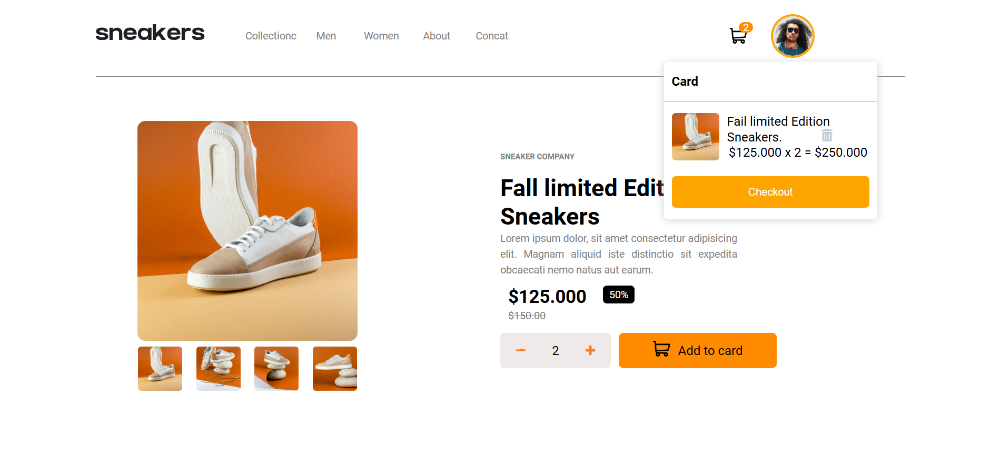
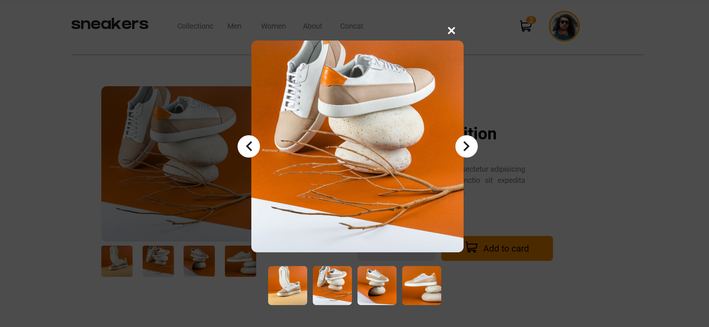
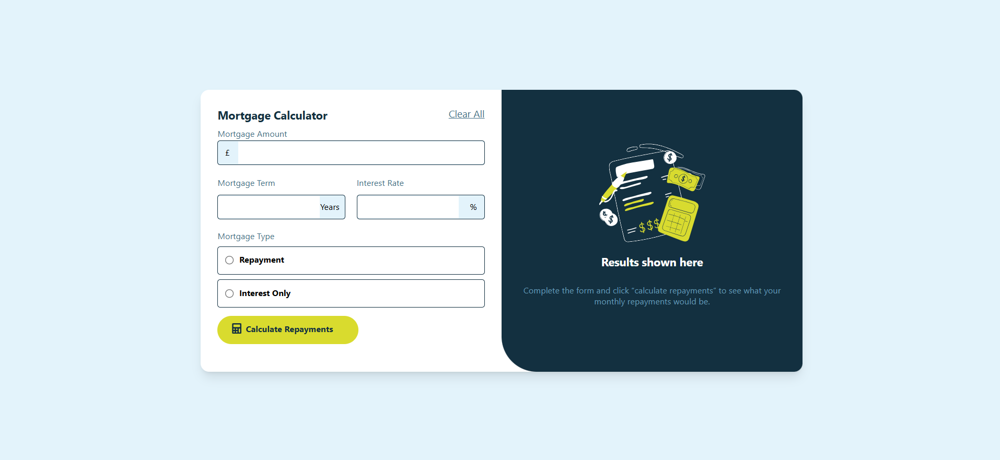
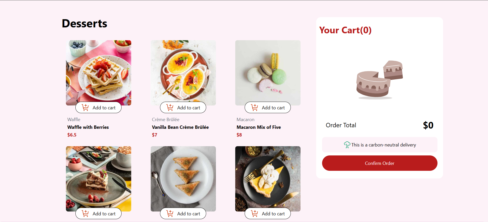
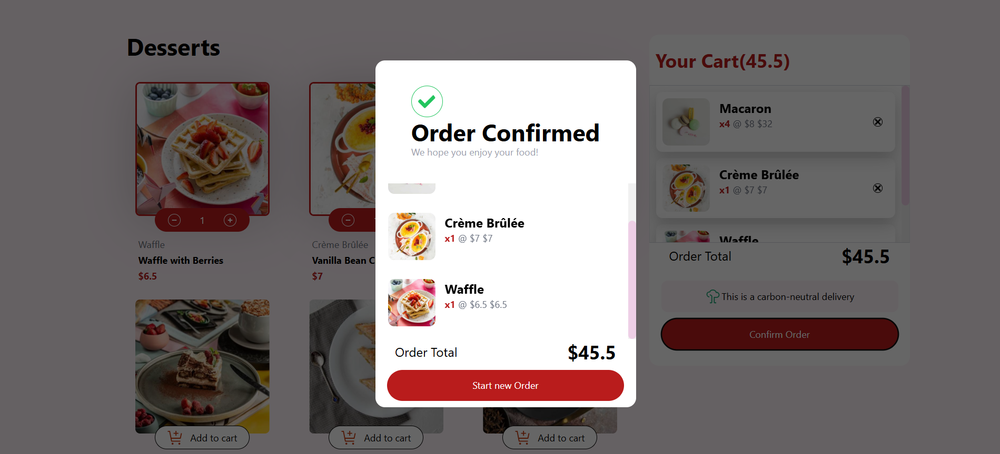
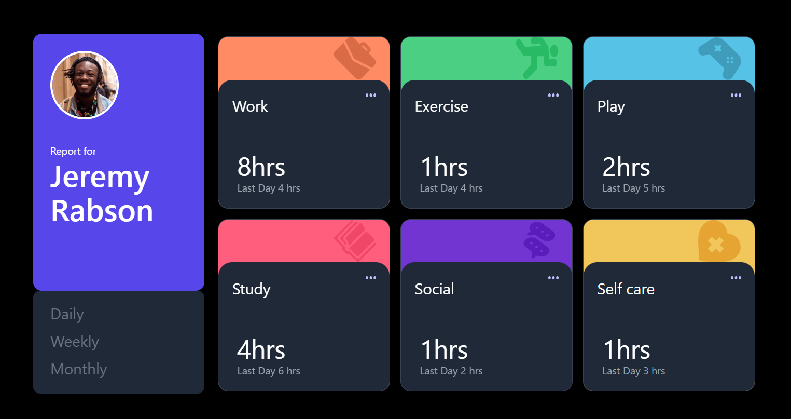

### Challenges and Progress
### Overview
These challenges were part of my journey to improve my frontend development skills. I worked on various UI components, interactive features, and layout designs to strengthen my understanding of HTML, CSS, JavaScript, React, and other web technologies.

### 1-age-calculator-app-main 📸

### 2-ecommerce-product-page-main 📸

### 3- interactive-card-details-form-main 📸

### 4- mortgage-repayment-calculator-main 📸

### 5 - product-list-with-cart-main 📸

### 6 -time-tracking-dashboard-main 📸

