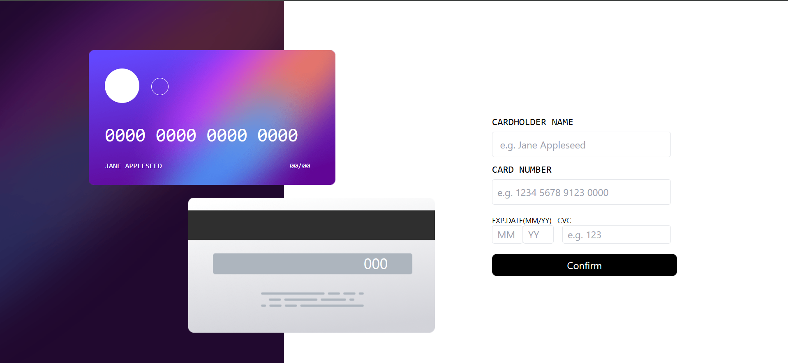

### Challenges and Progress
### Overview
These challenges were part of my journey to improve my frontend development skills. I worked on various UI components, interactive features, and layout designs to strengthen my understanding of HTML, CSS, JavaScript, React, and other web technologies.

### 1-age-calculator-app-main

### 2-ecommerce-product-page-main

### 3- interactive-card-details-form-main

