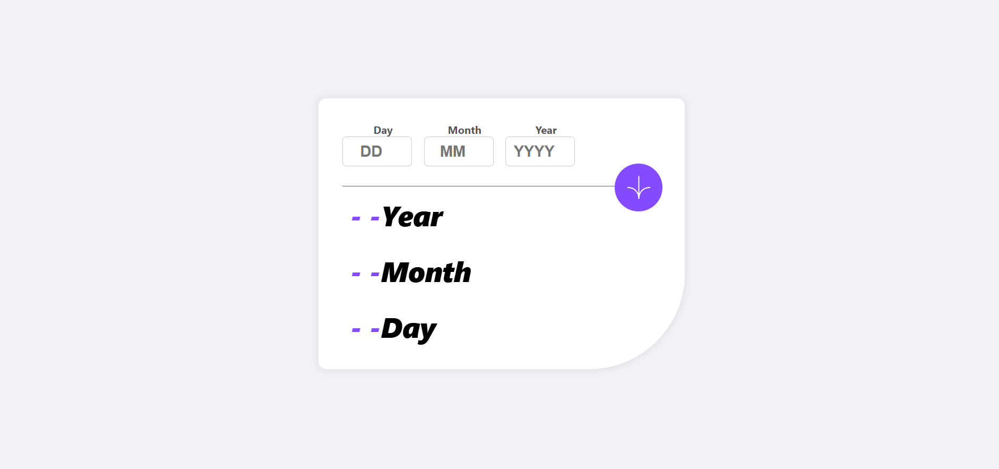

### Age Calculator App
This project is a simple and interactive Age Calculator built using HTML, CSS, and JavaScript. It allows users to input their birth date (day, month, and year) and calculate their exact age in years, months, and days.

### Screenshot of the App 📸

### Introduction
The Age Calculator App calculates your exact age based on your birth date. It is a simple, yet elegant project designed to provide an easy-to-use interface with real-time validation and results. The app uses form validation to ensure that users input valid dates, and displays the results with smooth animations.

### Features ✨
-Date Input Validation: Ensures that users input valid dates for the day, month, and year.
-Real-time Age Calculation: Calculates age in years, months, and days as soon as the user clicks the "Calculate Age" button.
-Responsive Design: Works seamlessly on both desktop and mobile devices.
-Smooth Animations: Animations are used to display the calculated age, making the app visually appealing.
-Clear Error Messages: If the user inputs invalid data, the app provides informative error messages.

### Technologies Used 🛠️
HTML: The structure and layout of the application.
CSS: Styling and layout for the app, including responsive design.
JavaScript: Logic for date validation and age calculation.
How to Use

Enter your birth date:
Enter the day, month, and year in the provided input fields.

The app will calculate and display your exact age in years, months, and days.

Error Handling:
If an invalid date is entered, an error message will be shown below the respective input field.
Responsive Layout:

The app adjusts to different screen sizes, making it user-friendly across all devices.
Project Setup
To run the Age Calculator app on your local machine, follow these steps:

1. Clone the repository
git clone https://github.com/khaduj03/Frontend-Mentor-challenges.git
2. Navigate into the project folder
cd age-calculator-app-main
3. Open the index.html file in your browser
Simply open the index.html file to start using the app.
4. Customize the styles (optional)
You can modify the styles.css file to change the look and feel of the app.

Feel free to explore, contribute, or modify the project as you wish. Happy coding! 🚀