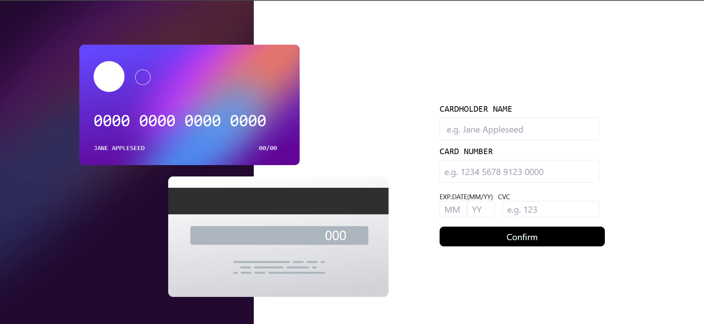
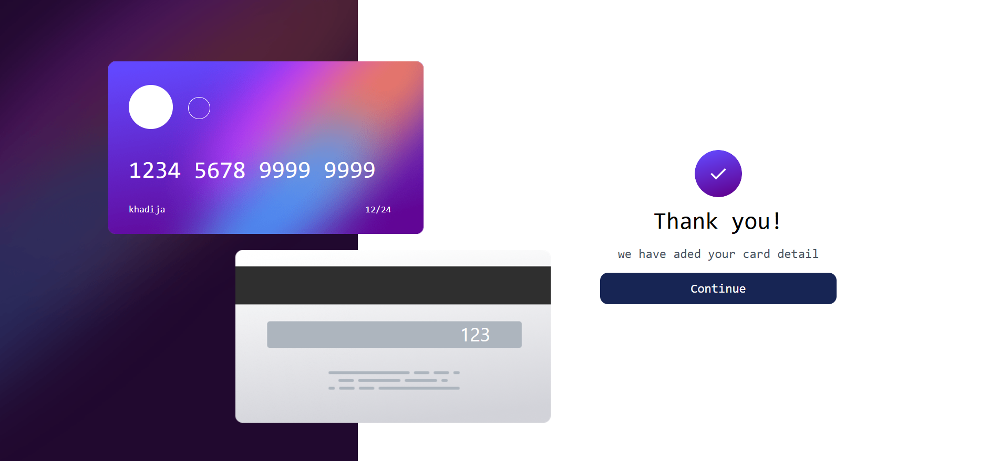

# Interactive Card Details Form 💳

This is a responsive interactive card details form built using **React** and **Tailwind CSS**. The application allows users to fill in their card details, validates the input fields, and displays a confirmation message upon successful submission.  

### Screenshots 📸

## Features ✨

- **Real-time Validation**: Ensures that the cardholder name, card number, expiration date, and CVC are valid.  
- **Error Messages**: Displays user-friendly error messages for invalid or missing inputs.  
- **Responsive Design**: Optimized for both desktop and mobile devices.  
- **Animations**: Smooth transitions between the form and the confirmation state.  

## Technologies Used 🛠️

- **React**: For building the user interface.  
- **Tailwind CSS**: For styling and ensuring responsiveness.  

## How to Use 🚀

1. Clone the repository:  
   git clone <repository-url>
   cd <project-directory>

2.Install dependencies:
  npm install

3.Run the project:
    npm start

4.Open the application in your browser at http://localhost:3000.

### Folder Structure 📂
src/
├── components/
│   ├── Complete.js         # Displays the confirmation state
│   ├── Form.js             # Handles the input form for card details
│   ├── FrontCard.js        # Renders the card design
├── App.js                  # Main application component
├── index.css               # Main styles
└── index.js                # Application entry point

