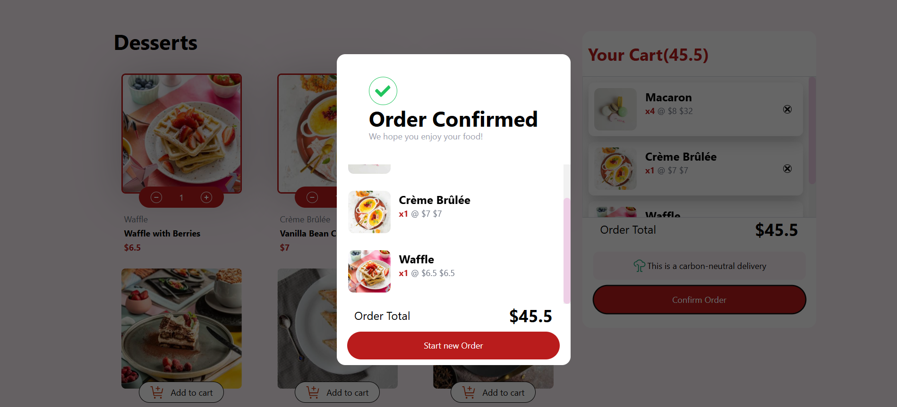

# Dessert E-Commerce App

This is a beautiful dessert e-commerce app that allows users to browse and add desserts to their cart. Users can view dessert details, adjust quantities, and place an order. The application has a smooth user interface with interactive animations powered by [Framer Motion](https://www.framer.com/motion/).

## ScreenShot 📸




## Features ✨
- **Interactive Dessert Cards**: Browse a variety of desserts with detailed descriptions and prices.
- **Cart Management**: Add, remove, or update dessert quantities in the cart.
- **Modal for Order Confirmation**: Displays the details of the user's order with a "Start New Order" option.
- **Responsive Design**: The app adapts to various screen sizes for both mobile and desktop views.
- **Smooth Animations**: Using [Framer Motion](https://www.framer.com/motion/), transitions and animations bring life to the app.

## Technologies Used🛠️

- **React**: The app is built using React for efficient UI rendering.
- **Framer Motion**: For smooth and elegant animations on page transitions and modal appearances.
- **React Icons**: For adding user-friendly icons to the UI, like the cart icon and quantity adjustment buttons.
- **CSS/TailwindCSS**: TailwindCSS is used for styling the components with responsive and clean layouts.

## Installation🖥️

To run the project locally, follow the steps below:

1. **Clone the repository**:

    ```
    git clone https://github.com/khaduj03/Frontend-Mentor-challenges.git
    ```

2. **Navigate to the project folder**:

    ```
    cd product-list-with-cart-main
    ```

3. **Install dependencies**:

    ```
    npm install
    ```

4. **Start the development server**:

    ```
    npm start
    ```

5. Open [http://localhost:3000](http://localhost:3000) in your browser to see the app.

## How It Works⚙️

1. **Dessert Cards**: Each dessert is displayed with an image, name, description, and price. Users can add a dessert to the cart by clicking the **Add to Cart** button.

2. **Cart Interaction**:
    - **Add to Cart**: Clicking the button will add the selected dessert to the cart. 
    - **Quantity Adjustment**: Once added, users can adjust the quantity of a dessert in the cart with the `+` and `-` buttons.
    - **Cart Details**: The cart displays the dessert items with their quantities, individual prices, and a total price.

3. **Order Confirmation**:
    - When the user clicks **Confirm Order**, a modal will appear showing the summary of the order and the total price.
    - The user can start a new order by clicking the **Start New Order** button.

## File Structure

```
dessert-ecommerce/
├── public/
│   ├── assets/
│   │   ├── images/
│   │   │   ├── image-waffle-desktop.jpg
│   │   │   ├── image-creme-brulee-desktop.jpg
│   │   │   ├── image-macaron-desktop.jpg
│   │   │   ├── image-tiramisu-desktop.jpg
│   │   │   ├── image-baklava-desktop.jpg
│   │   │   ├── image-meringue-desktop.jpg
│   │   │   ├── image-cake-desktop.jpg
│   │   │   └── image-brownie-desktop.jpg
│   │   └── icon-add-to-cart.svg
├── src/
│   ├── components/
│   │   ├── DessertCard.js
│   │   ├── OrderCard.js
│   │   └── ModalOrder.js
│   ├── App.js
│   ├── App.css
│   └── index.js
├── package.json
└── README.md
```
Components
App.js
The main application component that holds the state for the order cart and renders the dessert cards and the order card components. It also controls the modal display for the order confirmation.

DessertCard.js
This component represents a single dessert item, showing its image, name, description, and price. Users can add the item to the cart or adjust the quantity if already added.

OrderCard.js
This component displays the user's cart with the dessert items added. It includes options to confirm the order or start a new order. It also shows the total price of all items in the cart.

ModalOrder.js
This component shows a modal confirming the order. It displays the details of the order, the total cost, and allows the user to start a new order.

### Acknowledgments 🙌
Inspired by various online Dessert E-Commerce App.
Special thanks to Frontend Mentor for design inspirations.